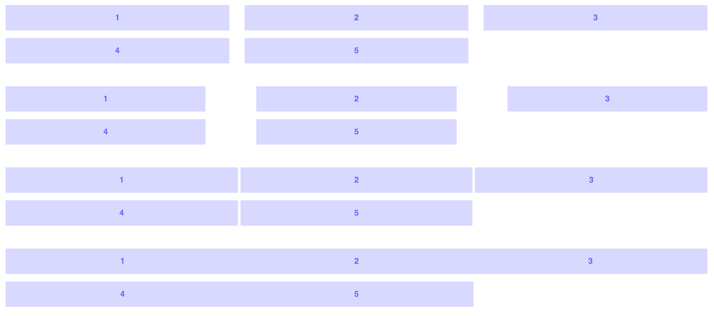

<h1 align="center">postcss-ant</h1>

<p align="center">
  
</p>

<p align="center">
  <b>by Cory Simmons</b>
</p>

<p align="center">
  <a href="https://gitter.im/postcss-ant/Lobby" target="_blank">
    
  </a>
</p>

<p align="center">
  <a href="https://www.npmjs.com/package/postcss-ant" target="_blank">
    
  </a>
  <a href="https://github.com/corysimmons/postcss-ant/blob/master/package.json" target="_blank">
    
  </a>
  <a href="https://github.com/corysimmons/postcss-ant/blob/master/LICENSE" target="_blank">
    
  </a>
</p>

## Table of Content

- [Getting Started](#getting-started)
  - [Installation](#installation)
  - [CLI Usage](#cli-usage)
  - [CLI Usage with Sass](#cli-usage-with-sass)
  - [Examples](#examples)
    - [Grid generation](#grid-generation)
    - [Plucking](#plucking)
    - [Bespoking asymmetrical ratio grid classes with preprocessor loops](#bespoking-asymmetrical-ratio-grid-classes-with-preprocessor-loops)
- [Order of operations](#order-of-operations)
- [API](#api)
  - [Global Settings](#global-settings)
    - [@ant-namespace](#ant-namespace)
    - [@ant-gutter](#ant-gutter)
    - [@ant-grid](#ant-grid)
    - [@ant-support](#ant-support)
  - [size()](#sizesize)
  - [sizes()](#sizesspace-separated-sizes)
  - [pluck()](#plucknumber)
  - [gutter()](#guttervalid-css-length)
  - [grid()](#gridnth-or-negative-margin)
  - [support()](#supportflexbox-or-float)
  - [pow()](#powbase-exponent)
  - [sum()](#sumarray-of-numbers)
  - [ratio()](#ratiobase-exponent)
  - [bump()](#bumpcalc-friendly-formula)
  - [generate-grid](#generate-grid-sizes-options-but-pluck-is-not-needed)
- [Reducing calc bloat with postcss-calc](#reducing-calc-bloat-with-postcss-calc)
- [Acknowledgements](#acknowledgements)

## Getting Started

### Installation

`npm i -D postcss-ant`

### CLI Usage

- `npm i -D postcss-cli`
- `postcss -w -u postcss-ant -o out.css in.css`

Using Webpack or something? Other PostCSS plugin usage instructions can be found [here](https://github.com/postcss/postcss#usage).

### CLI Usage with Sass

- `npm i -D node-sass`
- `node-sass -w in.scss out.css`
- `postcss -w -u postcss-ant -o final.css out.css`

### Examples

All of ant's functionality works with vanilla CSS, or any preprocessor. Throughout examples and documentation, I'll be using SCSS since some of its sugar can make ant's syntax very terse.

##### Grid generation


```html
<div class="grid">
  <div>1</div>
  <div>2</div>
  <div>3</div>
  <div>4</div>
  <div>5</div>
</div>
```

```scss
// in.scss
.grid {
  generate-grid:
    sizes(1/2 1/4 1/4)
    grid(negative-margin)
  ;
}
```

```scss
// final.css
.grid {
  display: flex;
  flex-wrap: wrap;
  margin-left: calc(-30px / 2);
  margin-right: calc(-30px / 2);
}

.grid > *  {
  margin-left: calc(30px / 2);
  margin-right: calc(30px / 2);
}

.grid > *:nth-child(3n + 1)  {
  width: calc(99.99% * 1/2 - 30px);
}

.grid > *:nth-child(3n + 2)  {
  width: calc(99.99% * 1/4 - 30px);
}

.grid > *:nth-child(3n + 3)  {
  width: calc(99.99% * 1/4 - 30px);
}
```

##### Plucking


```html
<div class="grid">
  <div class="fixed-100px">1</div>
  <div class="half-sans-100px">2</div>
  <div class="half-sans-100px">3</div>
</div>
```

```scss
// in.scss
.fixed-100px {
  float: left;
  width: 100px;
  margin-right: 30px;
}

.half-sans-100px {
  float: left;
  width:
    sizes(100px 1/2)
    pluck(2)
  ;
  margin-right: 30px;

  &:last-child {
    margin-right: 0;
  }
}
```

```scss
// final.css
.fixed-100px {
  float: left;
  width: 100px;
  margin-right: 30px;
}

.half-sans-100px {
  float: left;
  width: calc((99.99% - (100px + (30px * 1))) * 1/2 - (30px - 30px * 1/2));
  margin-right: 30px;
}

.half-sans-100px:last-child {
  margin-right: 0;
}
```

##### Bespoking asymmetrical ratio grid classes with preprocessor loops


```html
<div class="grid">
  <div class="column-1">1</div>
  <div class="column-2">2</div>
  <div class="column-3">3</div>
  <div class="column-1">1</div>
  <div class="column-2">2</div>
</div>
```

```scss
// in.scss
$gutter: 15px;
$ratio: 1.618;
$sizes:
  ratio($ratio, 2)
  ratio($ratio, 6)
  ratio($ratio, 4)
;
$length: length($sizes);

.grid {
  display: flex;
  flex-wrap: wrap;
  margin-left: -$gutter / 2;
  margin-right: -$gutter / 2;

  > * {
    margin-left: $gutter / 2;
    margin-right: $gutter / 2;
  }
}

@for $i from 1 through $length {
  .column-#{$i} {
    width:
      sizes($sizes)
      gutter($gutter)
      pluck($i)
      grid(negative-margin)
    ;
  }
}
```

```scss
// final.css
.grid {
  display: flex;
  flex-wrap: wrap;
  margin-left: -7.5px;
  margin-right: -7.5px;
}

.grid > * {
  margin-left: 7.5px;
  margin-right: 7.5px;
}

.column-1 {
  width: calc(99.99% * 2.6179240000000004/27.41346045246828 - 15px);
}

.column-2 {
  width: calc(99.99% * 17.942010382692274/27.41346045246828 - 15px);
}

.column-3 {
  width: calc(99.99% * 6.853526069776002/27.41346045246828 - 15px);
}
```

#### Order of operations

Math methods are performed before anything else in this order:
1. `pow()`
1. `sum()`
1. `ratio()`

So you can use `pow()` inside of `sum()`, but not the other way around.

Sizes take precedence in this order:
1. fixed numbers
1. fractions
1. autos


- `sizes(1/2 100px auto) pluck(2)` would return `100px`.
- `sizes(1/2 100px auto) pluck(1)` would return `(100% - 100px) * 1/2` (half of the container sans the `100px`).
- `sizes(1/2 100px auto) pluck(3)` would return `100% - ((100% - 100px) * 1/2)` (whatever is leftover after half the container sans `100px`).

> **Note:** Returned `calc` formulas are gutter-aware/grid-friendly (it can get crazy), so don't take the pseudocode above literally.

## API

You can mix-and-match a bunch of these functions. ant has pretty friendly console errors to guide you.

### Global Settings

You can override global settings (except `@ant-namespace`) on a local setting level.

###### @ant-namespace

Define a namespace for your project. The `generate-grid` property and **all** other methods (`sizes(), ratio(), etc.`) get this namespace.

It is up to you to define the separator like so: `@ant-namespace acme-;`

There is no default namespace since namespaces look pretty bad and this code will be processed **before** it gets to a browser (so future W3C specs won't clash). The only way I see this being a problem is if you are using a preprocessor library that might clash. For instance, a Sass library with a `sizes()` mixin would throw an error.

###### @ant-gutter

A global gutter setting. `30px` by default. Can be any valid CSS length. Can be overridden with `gutter()`.

###### @ant-grid

Defines the type of `calc` formulas to return results for. `nth` by default. Can be `nth` or `negative-margin`. Can be overridden with `grid()`.

###### @ant-support

Defines if you want to support older browsers. `flexbox` by default. Can be `flexbox` or `float`. Can be overridden with `support()`.

### size(*size*)

*size* can be a lot of things:
- any valid CSS length
  - `px`, `em`, `%`, `ex`, `ch`, etc.
- fractions
- decimals
- `auto` keyword

Handy for when you want to cast a symmetrical fractional grid.


```html
<div class="thirds">1</div>
<div class="thirds">2</div>
<div class="thirds">3</div>
<div class="thirds">4</div>
<div class="thirds">5</div>
```

```scss
// in.scss
.thirds {
  float: left;
  width: size(1/3);
  margin-right: 30px;

  &:nth-child(3n + 3) {
    margin-right: 0;
  }
}
```

```scss
// final.css
.thirds {
  float: left;
  width: calc(99.99% * 1/3 - (30px - 30px * 1/3));
  margin-right: 30px;
}

.thirds:nth-child(3n + 3) {
  margin-right: 0;
}
```

### sizes(*space separated sizes*)

`sizes()` is ant's required/primary method used to generate/return the `calc` formulas.

`sizes()` can be used within the `generate-grid` property by itself, but requires `pluck()` outside of the `generate-grid` property.

> **Note:** `auto` is a keyword that will fill the remaining space after other sizes have been processed. Multiple `auto`s will divide the space amongst themselves. `flex-grow` cannot do this and the final element in this grid would overexpand to the right edge.


```html
<div class="grid">
  <div>1</div>
  <div>2</div>
  <div>3</div>
  <div>4</div>
  <div>5</div>
  <div>6</div>
</div>
```

```scss
// in.scss
.grid {
  generate-grid: sizes(250px auto 1/5 auto);
}
```

```scss
// final.css
.grid {
  display: flex;
  flex-wrap: wrap;
}

.grid > *  {
  margin-right: 30px;
}

.grid > *:nth-child(4n + 1)  {
  width: 250px;
}

.grid > *:nth-child(4n + 2)  {
  width: calc((99.99% - ((250px + (30px * 1)) + ((99.99% - (250px + (30px * 1))) * (1/5) - (30px - 30px * (1/5)))) - (30px * 2)) / 2);
}

.grid > *:nth-child(4n + 3)  {
  width: calc((99.99% - (250px + (30px * 1))) * 1/5 - (30px - 30px * 1/5));
}

.grid > *:nth-child(4n + 4)  {
  width: calc((99.99% - ((250px + (30px * 1)) + ((99.99% - (250px + (30px * 1))) * (1/5) - (30px - 30px * (1/5)))) - (30px * 2)) / 2);
  margin-right: 0;
}
```

### pluck(*number*)

`pluck()` is used to "pluck" a grid-friendly value from the list within `sizes()`. It is a **1-based** index to `sizes()`. It is 1-based to align with how `nth` selectors number things. This makes it easy to loop over with the same iterator when assigning values to both `nth` selectors and `pluck()`. 

It is not needed when you are using the singular `size()` or when you are using `grid-generator`.


```html
<-- The container isn't needed. It's just included so you can see the autos in action. -->
<div class="container">
  <div class="center-two-sevenths">1</div>
</div>
```

```scss
// in.scss
$sizes: auto 2/7 auto;

.center-two-sevenths {
  margin-left:
    sizes($sizes)
    pluck(1)
  ;
  width:
    sizes($sizes)
    pluck(2)
  ;
  margin-right:
    sizes($sizes)
    pluck(3)
  ;
}

```

```scss
// final.css
.center-two-sevenths {
  margin-left: calc(((99.99% - (99.99% * (2/7) - (30px - 30px * (2/7)))) / 2) - 30px);
  width: calc(99.99% * 2/7 - (30px - 30px * 2/7));
  margin-right: calc(((99.99% - (99.99% * (2/7) - (30px - 30px * (2/7)))) / 2) - 30px);
}
```

### gutter(*valid CSS length*)

This local method can override the global gutter (which defaults to `30px`). With it you can adjust the gutters between elements.



```html
<div class="grid-default-gutters">
  <div>1</div>
  <div>2</div>
  <div>3</div>
  <div>4</div>
  <div>5</div>
</div>

<div class="grid-big-gutters">
  <div>1</div>
  <div>2</div>
  <div>3</div>
  <div>4</div>
  <div>5</div>
</div>

<div class="grid-small-gutters">
  <div>1</div>
  <div>2</div>
  <div>3</div>
  <div>4</div>
  <div>5</div>
</div>

<div class="grid-no-gutters">
  <div>1</div>
  <div>2</div>
  <div>3</div>
  <div>4</div>
  <div>5</div>
</div>
```

```scss
// in.scss
.grid-default-gutters {
  generate-grid: sizes(1/3 1/3 1/3);
}

.grid-big-gutters {
  generate-grid: sizes(1/3 1/3 1/3) gutter(100px);
}

.grid-small-gutters {
  generate-grid: sizes(1/3 1/3 1/3) gutter(5px);
}

.grid-no-gutters {
  generate-grid: sizes(1/3 1/3 1/3) gutter(0);
}
```

```scss
// final.css
// Default Gutters
.grid-default-gutters {
  display: flex;
  flex-wrap: wrap;
}

.grid-default-gutters > *  {
  margin-right: 30px;
}

.grid-default-gutters > *:nth-child(3n + 1)  {
  width: calc(99.99% * 1/3 - (30px - 30px * 1/3));
}

.grid-default-gutters > *:nth-child(3n + 2)  {
  width: calc(99.99% * 1/3 - (30px - 30px * 1/3));
}

.grid-default-gutters > *:nth-child(3n + 3)  {
  width: calc(99.99% * 1/3 - (30px - 30px * 1/3));
  margin-right: 0;
}

// Big Gutters
.grid-big-gutters {
  display: flex;
  flex-wrap: wrap;
}

.grid-big-gutters > *  {
  margin-right: 100px;
}

.grid-big-gutters > *:nth-child(3n + 1)  {
  width: calc(99.99% * 1/3 - (100px - 100px * 1/3));
}

.grid-big-gutters > *:nth-child(3n + 2)  {
  width: calc(99.99% * 1/3 - (100px - 100px * 1/3));
}

.grid-big-gutters > *:nth-child(3n + 3)  {
  width: calc(99.99% * 1/3 - (100px - 100px * 1/3));
  margin-right: 0;
}

// Small Gutters
.grid-small-gutters {
  display: flex;
  flex-wrap: wrap;
}

.grid-small-gutters > *  {
  margin-right: 5px;
}

.grid-small-gutters > *:nth-child(3n + 1)  {
  width: calc(99.99% * 1/3 - (5px - 5px * 1/3));
}

.grid-small-gutters > *:nth-child(3n + 2)  {
  width: calc(99.99% * 1/3 - (5px - 5px * 1/3));
}

.grid-small-gutters > *:nth-child(3n + 3)  {
  width: calc(99.99% * 1/3 - (5px - 5px * 1/3));
  margin-right: 0;
}

// No Gutters
.grid-no-gutters {
  display: flex;
  flex-wrap: wrap;
}

.grid-no-gutters > *  {
  margin-right: 0;
}

.grid-no-gutters > *:nth-child(3n + 1)  {
  width: calc(99.999999% * 1/3);
}

.grid-no-gutters > *:nth-child(3n + 2)  {
  width: calc(99.999999% * 1/3);
}

.grid-no-gutters > *:nth-child(3n + 3)  {
  width: calc(99.999999% * 1/3);
  margin-right: 0;
}
```

### grid(*[nth or negative-margin]*)

Define the type of `calc` formula you would like back.

ant defaults to `nth` grids (grids where you have to set `margin-right: 0` to the last element in every row). These grids are very handy when you know the number of elements that will go on a row, so are ideal for casting generic layout elements. For a 2-column grid, the math involved for these is something like `100% * 1/2 - (30px - 30px * 1/2)`.

`negative-margin` grids put a margin on each side of the columns, and require the container element to have negative margins applied to its sides (to pull the columns back out flush with the rest of the layout). These grids are ideal when you don't know the number of elements-per-row (for instance, a photo gallery with pictures of varying sizes). The math for a 2-column `negative-margin` grid is something like `100% * 1/2 - 30px`. These grids get pretty hairy when nesting.

Really make an effort to pick the type of grid you need on a case-by-case level. This will save you markup and/or style bloat.

```scss
// in.scss
.nth-grid {
  display: flex;
  flex-wrap: wrap;
}

.nth-column {
  width: size(1/3) grid(nth);
  margin-right: 30px;

  &:nth-child(3n + 3) {
    margin-right: 0;
  }
}

.negative-margin-grid {
  display: flex;
  flex-wrap: wrap;
  margin-left: -15px;
  margin-right: -15px;
}

.negative-margin-column {
  width:
    size(1/3)
    grid(negative-margin)
  ;
  margin-left: 15px;
  margin-right: 15px;
}
```

```scss
// final.css
.nth-grid {
  display: flex;
  flex-wrap: wrap;
}

.nth-column {
  width: calc(99.99% * 1/3 - (30px - 30px * 1/3));
  margin-right: 30px;
}

.nth-column:nth-child(3n + 3) {
  margin-right: 0;
}

.negative-margin-grid {
  display: flex;
  flex-wrap: wrap;
  margin-left: -15px;
  margin-right: -15px;
}

.negative-margin-column {
  width: calc(99.99% * 1/3 - 30px);
  margin-left: 15px;
  margin-right: 15px;
}
```

### support(*[flexbox or float]*)

The type of grids to generate when using `grid-generator`. This can (and probably should) be used on a global level via the `@ant-support` setting.

With calc polyfills, float layouts will work in IE8.

Think about your audience. If you're making a site for your grandparents' bridge club, `float`. In most cases, flexbox support is very good and will produce less CSS bloat (no clearfix). Just be aware of the many [flexbugs](https://github.com/philipwalton/flexbugs).

```scss
// in.scss
.flexbox-grid {
  generate-grid:
    sizes(1/2 auto 100px)
    support(flexbox)
  ;
}

.float-grid {
  generate-grid:
    sizes(1/2 auto 100px)
    support(float)
  ;
}
```

```scss
// final.css
.flexbox-grid {
  display: flex;
  flex-wrap: wrap;
}

.flexbox-grid > *  {
  margin-right: 30px;
}

.flexbox-grid > *:nth-child(3n + 1)  {
  width: calc((99.99% - (100px + (30px * 1))) * 1/2 - (30px - 30px * 1/2));
}

.flexbox-grid > *:nth-child(3n + 2)  {
  width: calc((99.99% - ((100px + (30px * 1)) + ((99.99% - (100px + (30px * 1))) * (1/2) - (30px - 30px * (1/2)))) - (30px * 1)) / 1);
}

.flexbox-grid > *:nth-child(3n + 3)  {
  width: 100px;
  margin-right: 0;
}

.float-grid > *  {
  float: left;
  margin-right: 30px;
}

.float-grid > *:nth-child(3n + 1)  {
  width: calc((99.99% - (100px + (30px * 1))) * 1/2 - (30px - 30px * 1/2));
  clear: left;
}

.float-grid > *:nth-child(3n + 2)  {
  width: calc((99.99% - ((100px + (30px * 1)) + ((99.99% - (100px + (30px * 1))) * (1/2) - (30px - 30px * (1/2)))) - (30px * 1)) / 1);
}

.float-grid > *:nth-child(3n + 3)  {
  width: 100px;
  margin-right: 0;
}

.float-grid:after,
.float-grid::after  {
  content: '';
  display: table;
  clear: both;
}
```

### pow(*base, exponent*)

`pow()` operates just like JS's `Math.pow`. It can be handy for bespoking custom ratios.

```scss
// in.scss
.small-golden-ratio-column {
  width: size(pow(1.618, 1)/pow(1.618, 4));
}

.big-golden-ratio-column {
  width: size(pow(1.618, 3)/pow(1.618, 4));
}
```

```scss
// final.css
.small-golden-ratio-column {
  width: calc(99.99% * 1.618/6.853526069776002 - (30px - 30px * 1.618/6.853526069776002));
}

.big-golden-ratio-column {
  width: calc(99.99% * 4.235801032000001/6.853526069776002 - (30px - 30px * 4.235801032000001/6.853526069776002));
}
```

### sum(*array of numbers*)

`sum()` is nice when combined with `pow()` to get the denominator of a custom ratio in an intelligent/flexible way.

```scss
// in.scss
$sizes: pow(1.618, 1) pow(1.618, 2) pow(1.618, 3);

.small-golden-ratio-column {
  width: size(nth($sizes, 1)/sum($sizes));
}

.medium-golden-ratio-column {
  width: size(nth($sizes, 2)/sum($sizes));
}

.big-golden-ratio-column {
  width: size(nth($sizes, 3)/sum($sizes));
}
```

```scss
// final.css
.small-golden-ratio-column {
  width: calc(99.99% * 1.618/8.471725032000002 - (30px - 30px * 1.618/8.471725032000002));
}

.medium-golden-ratio-column {
  width: calc(99.99% * 2.6179240000000004/8.471725032000002 - (30px - 30px * 2.6179240000000004/8.471725032000002));
}

.big-golden-ratio-column {
  width: calc(99.99% * 4.235801032000001/8.471725032000002 - (30px - 30px * 4.235801032000001/8.471725032000002));
}
```

### ratio(*base, exponent*)

Combining `pow()` and `sum()` to create grid-friendly ratio sizes is very common. `ratio()` turns that pattern into a one-step process.

It works best with `sizes()` -- not `size()` -- since it automagically calculates the denominator by collecting/adding all `ratio()` numerators within that `sizes()` method.

```scss
// in.scss
$sizes:
  ratio(1.618, 1)
  ratio(1.618, 2)
  ratio(1.618, 3)
;

.small-golden-ratio-column {
  width: sizes($sizes) pluck(1);
}

.medium-golden-ratio-column {
  width: sizes($sizes) pluck(2);
}

.big-golden-ratio-column {
  width: sizes($sizes) pluck(3);
}
```

```scss
// final.css
.small-golden-ratio-column {
  width: calc(99.99% * 1.618/8.471725032000002 - (30px - 30px * 1.618/8.471725032000002));
}

.medium-golden-ratio-column {
  width: calc(99.99% * 2.6179240000000004/8.471725032000002 - (30px - 30px * 2.6179240000000004/8.471725032000002));
}

.big-golden-ratio-column {
  width: calc(99.99% * 4.235801032000001/8.471725032000002 - (30px - 30px * 4.235801032000001/8.471725032000002));
}
```

### bump(*`calc`-friendly formula*)

`bump()` is useful when the returned `calc` formula is a little bit off (usually by parts of the gutter). You can feed it any calc-friendly formula (sorry, you can't nest `sizes(), pluck(), etc.` within it), and it will append the formula to the end of the original formula.

This can be a subtraction to the formula as well (e.g. `bump(-15px)`).

This is particularly helpful when offsetting or source ordering elements. `bump()` can be used to help nudge your way to many solutions.

```html
<div class="grid">
  <div class="push-right-by-fourth">1</div>
  <div>2</div>
  <div>3</div>
</div>
```

```scss
// in.scss
$gutter: 30px;

.grid {
  display: flex;

  div {
    width: size(1/4);
    margin-right: $gutter;

    &:last-child {
      margin-right: 0;
    }
  }

  .push-right-by-fourth {
    margin-right: size(1/4) bump($gutter * 2);
  }
}
```

```scss
// final.css
.grid {
  display: flex;
}

.grid div {
  width: calc(99.99% * 1/4 - (30px - 30px * 1/4));
  margin-right: 30px;
}

.grid div:last-child {
  margin-right: 0;
}

.grid .push-right-by-fourth {
  margin-right: calc(99.99% * 1/4 - (30px - 30px * 1/4)  + 60px);
}
```

### generate-grid: *sizes() [options but pluck() is not needed]*;

`generate-grid` is a CSS declaration property (like `font-size`), that accepts `sizes()`. It will loop over the number of sizes, creating valid/minimal styles for each `nth-child` in the list of sizes (even if you're using a negative-margin grid).

This is extremely handy for casting bulletproof grids in a speedy way.

That said, don't rely solely on `generate-grid` for everything. It's very possible you might just need to `pluck()` a few sizes instead of creating bloat by casting all the styles for an unnecessary grid system. Always consider what you're building.

```scss
// in.scss
.three-column-grid {
  generate-grid: sizes(1/3 1/3 1/3);
}

.holy-grail-golden-ratio-grid {
  generate-grid:
    sizes(
      ratio(1.618, 4)
      ratio(1.618, 6)
      ratio(1.618, 4)
    )
  ;
}
```

```scss
// final.css
.three-column-grid {
  display: flex;
  flex-wrap: wrap;
}

.three-column-grid > *  {
  margin-right: 30px;
}

.three-column-grid > *:nth-child(3n + 1)  {
  width: calc(99.99% * 1/3 - (30px - 30px * 1/3));
}

.three-column-grid > *:nth-child(3n + 2)  {
  width: calc(99.99% * 1/3 - (30px - 30px * 1/3));
}

.three-column-grid > *:nth-child(3n + 3)  {
  width: calc(99.99% * 1/3 - (30px - 30px * 1/3));
  margin-right: 0;
}

.holy-grail-golden-ratio-grid {
  display: flex;
  flex-wrap: wrap;
}

.holy-grail-golden-ratio-grid > *  {
  margin-right: 30px;
}

.holy-grail-golden-ratio-grid > *:nth-child(3n + 1)  {
  width: calc(99.99% * 6.853526069776002/31.64906252224428 - (30px - 30px * 6.853526069776002/31.64906252224428));
}

.holy-grail-golden-ratio-grid > *:nth-child(3n + 2)  {
  width: calc(99.99% * 17.942010382692274/31.64906252224428 - (30px - 30px * 17.942010382692274/31.64906252224428));
}

.holy-grail-golden-ratio-grid > *:nth-child(3n + 3)  {
  width: calc(99.99% * 6.853526069776002/31.64906252224428 - (30px - 30px * 6.853526069776002/31.64906252224428));
  margin-right: 0;
}
```

### Reducing `calc` bloat with postcss-calc

ant can generate some pretty gnarly `calc` formulas. You can mitigate this problem by using postcss-calc *after* postcss-ant has been processed.

- `npm i -D postcss-calc`
- `node-sass -w in.scss out.css`
- `postcss -w -u postcss-ant -u postcss-calc -o final.css out.css`

```scss
// in.scss
.crazy {
  width: sizes(1/3 auto 120px auto 1/7 50px) pluck(2);
}
```

```scss
// final.css BEFORE postcss-calc
.crazy {
  width: calc((99.99% - (((120px + 50px) + (30px * 2)) + ((99.99% - ((120px + 50px) + (30px * 2))) * (1/3 + 1/7) - (30px - 30px * (1/3 + 1/7)))) - (30px * 2)) / 2);
}

// final.css AFTER postcss-calc
.crazy {
  width: calc((99.99% - (230px + ((99.99% - 230px) * 0.476190476190476 - 15.71428571428572px)) - 60px) / 2);
}
```

> **Note:** postcss-calc isn't perfect. On rare occasions it will break ant. If you're confident your ant methods are correct, and things still aren't lining up, try disabling postcss-calc to confirm where the problem is. You may also be able to adjust postcss-calc's precision option to fix the problem.

> It also does not condense **everything**. Please open detailed issues in that project if something obvious (e.g. `(30px * 1)`) isn't being condensed.

## Acknowledgements

- [Neil Kistner](http://neilkistner.com/) for dumping a ton of work into the original version of this; watching me scrap the entire thing; and continuing to help. The man is a saint and amazing JS developer.
- [Alex Bass](https://abass.co/) for letting me bounce ideas off him and making me think about adding an `auto` keyword, which started me down this whole rabbit-hole.
- [Kristian Frost](http://kristianfrost.com) for supporting my grid work for years -- literally the only person to show interest in this project during development.
- [Maria Keller](http://www.mariakellerac.com/) for her consistently excellent logo work.
- [Peter Ramsing](http://peter.coffee/) for doing an excellent job at maintaining Lost which afforded me time to pursue development of ant.
- [Ben Briggs](http://beneb.info/) for putting up with my trollery and continuing to help me grow as a PostCSS developer.
- [Andrey Sitnik](http://sitnik.ru/) for not only developing PostCSS, but for being an amazingly helpful maintainer.
- [Maxime Thirouin](https://moox.io/) for developing postcss-calc which helps make some ant formulas look intentional.
- [You](http://bit.ly/2c8iVpI) for showing the slightest interest in something that looks like a "grid system" after your very valid complaints went without answers for so many years. I hope this tool will bring you happiness and help you build a more beautiful web.
